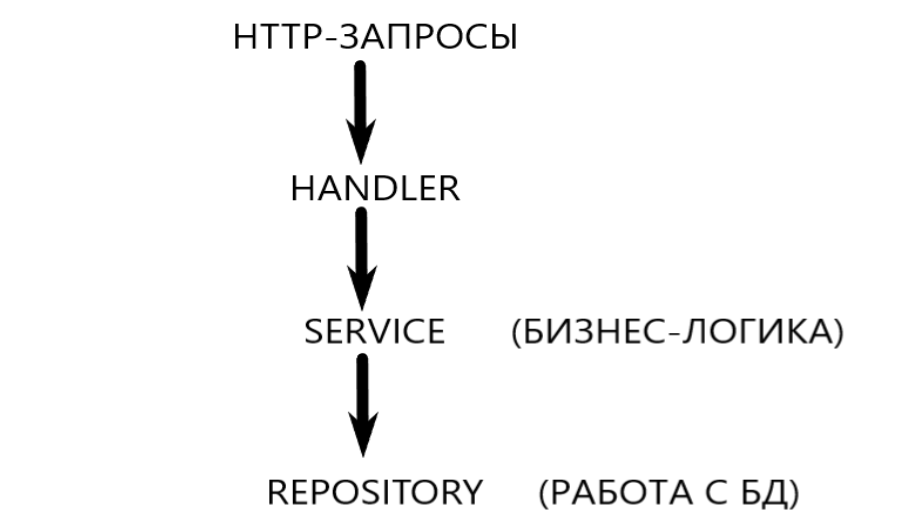
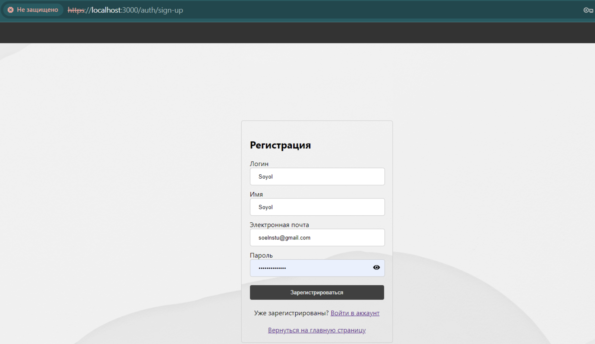
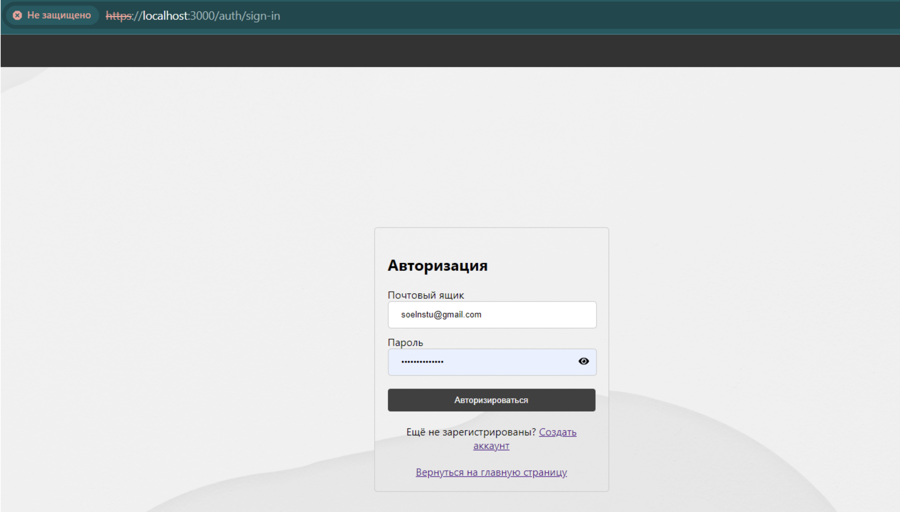
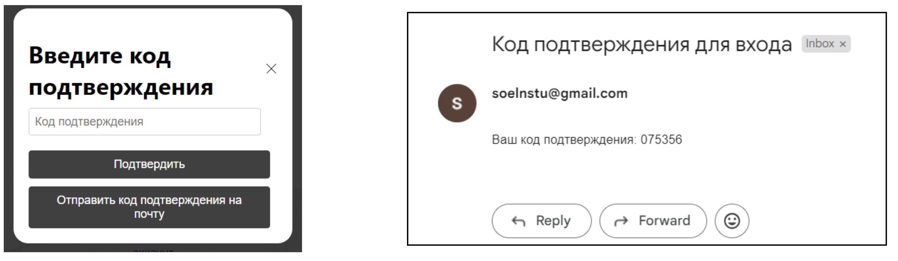
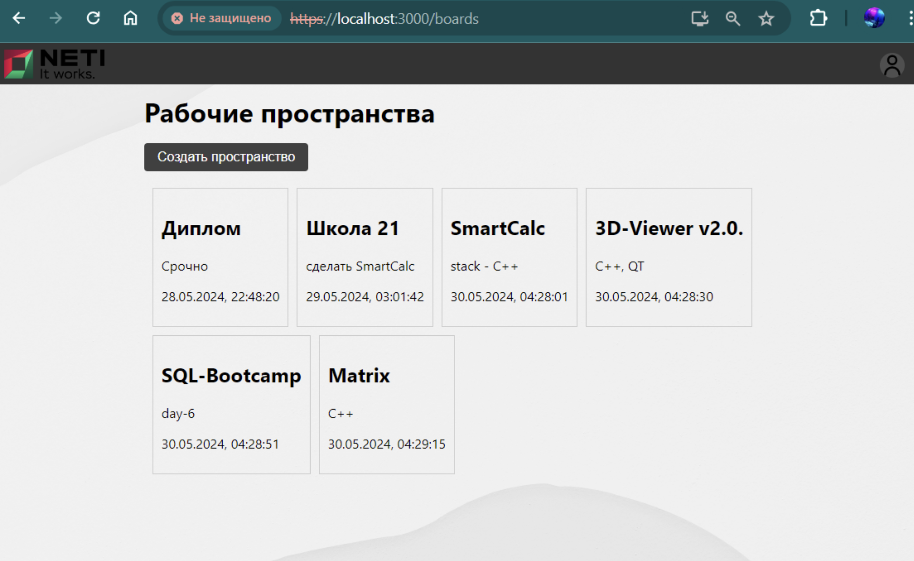
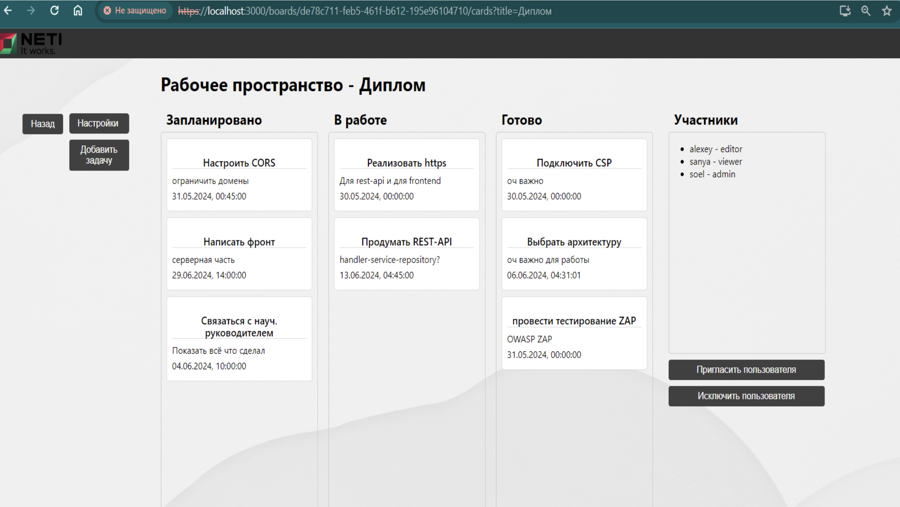

# Веб-приложение для управления проектами

Этот проект представляет собой веб-приложение для управления проектами, разработанное с акцентом на конфиденциальность и целостность данных. Бэкенд приложения реализован на Go и предоставляет REST-API для обработки HTTP-запросов и управления данными.

## Структура проекта

Структура веб-приложения следует слоистой архитектуре, как показано ниже:



- **Handler**: Обрабатывает HTTP-запросы и перенаправляет их в соответствующие методы сервиса.
- **Service**: Содержит бизнес-логику приложения, обрабатывает данные, полученные от хендлеров, перед отправкой в репозиторий.
- **Repository**: Взаимодействует непосредственно с базой данных, выполняет запросы и возвращает данные на уровень сервиса.

## Makefile

Предоставленный `Makefile` включает команды для сборки проекта, запуска контейнеров Docker и управления миграциями базы данных. Ниже приведено краткое описание каждой команды:

- `include .env`: Загружает переменные окружения из файла `.env`.
- `DATABASE = restapi_dev`: Устанавливает имя базы данных по умолчанию для приложения.

### Команды

- `build`: Компилирует Go-приложение.
    ```sh
    make build
    ```

- `docker_run`: Запускает Docker-контейнер для базы данных с настройками, указанными в `$(DOCKER_SETTING)`.
    ```sh
    make docker_run
    ```

- `migrate_up`: Применяет все миграции к базе данных с использованием инструмента `migrate`.
    ```sh
    make migrate_up
    ```

- `migrate_down`: Отменяет все миграции с использованием инструмента `migrate`.
    ```sh
    make migrate_down
    ```

## Переменные окружения

Убедитесь, что у вас есть файл `.env` в корневом каталоге с необходимыми переменными окружения. Эти переменные используются Makefile и самим приложением.

## Пример полной работы веб-приложения

Окно регистрации


Окно авторизации


Модальное окно для ввода кода подтверждения и пример кода подтверждения, отправленный на почту


Окно с рабочими пространствами


Окно с задачами рабочего пространства


## Участие в проекте

This project was developed by a student of NSTU: jereyji

